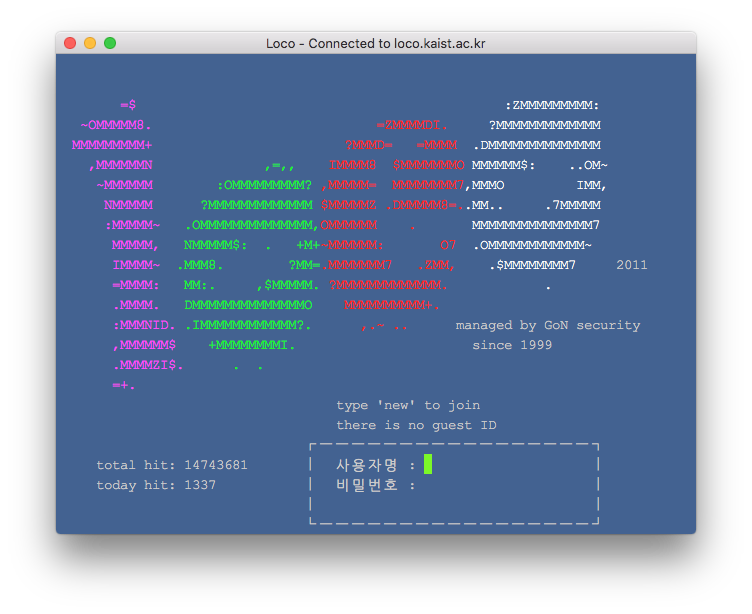

lyomiTerm
=========

This is a MacOS app for connecting to legacy Korean telnet server. It uses the CP949 encoding that most Korean telnet servers operate on, and includes a [Korean keyboard automata implementation](lyomiTerm/Korean.mm). For non-Korean telnet client, using `/usr/bin/telnet` on a general-purpose terminal like [iTerm](https://www.iterm2.com/) is recommended.

It does not provide a dialog for entering the server address and the user will have to edit [PieView.mm](lyomiTerm/PieView.mm) to set the connection information.

--

한국 텔넷 서버에 접속하기 위한 맥OS용 클라이언트입니다. 따로 접속 정보를 입력하는 다이얼로그를 포함하지 않아서 사용하시는 분께서 [PieView.mm](lyomiTerm/PieView.mm)를 직접 수정한 다음 빌드해야 합니다.